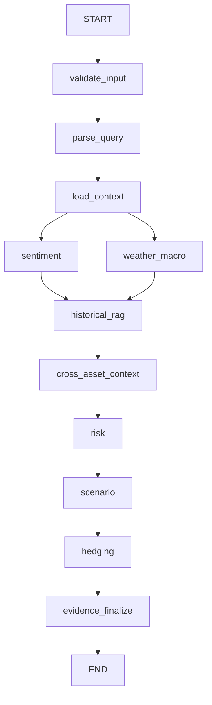

# Phase 4: Multi-Agent Financial Intelligence Engine

This document outlines the architecture and design of the Phase 4 orchestration engine, satisfying the requirements for the portfolio intelligence system.

## 1. Architecture
The system employs a multi-agent orchestration architecture using LangGraph. The `AnalysisState` acts as the shared typed state containing user intent, contexts, metrics, generated outputs, trace information, and an evidence drawer.

## 2. Responsibilities of each agent
* **Query Parser**: Deterministically extracts intent, symbols, regions, and tasks from free text.
* **Context Loader**: Fetches deterministic market and portfolio data using the `market_provider`.
* **Sentiment Agent**: Consumes mock news feeds and runs FinBERT inference to evaluate news polarity.
* **Weather + Macro Agent**: Interfaces with FRED for macroeconomic factors and mock APIs for weather conditions.
* **Historical RAG Agent**: Embeds user query to retrieve historical analogues and their asset impacts via `pgvector`.
* **Cross-Asset Context**: Aggregates correlations and past standard reactions across retrieved events.
* **Risk Agent**: Computes portfolio VaR, CVaR, volatility, and generic stress tests using Phase 2 `RiskEngine`.
* **Scenario Engine**: Constructs an explicit simulation modeling the current impact if it mimics historical responses.
* **Hedging Agent**: Consumes risk + scenario to propose actionable (but strictly simulated) mitigations.

## 3. LangGraph Graph

## 4. Fallback Behavior
All agents return explicit "status" fields (`missing`, `fallback`, `unavailable`). No data is fabricated or imputed. For example, a missing weather API simply returns `status: unavailable`, allowing downstream agents (like Hedging) to degrade gracefully or skip depending on prerequisites.

## 5. Audit Trail & Evidence Model
The state enforces a rigorous `evidence` array and an `agent_trace` array. Everything generated pushes to these arrays, ensuring Phase 5 synthesis (Grok) can cite sources. The entire run and simulated recommendations are saved to SQLite via `AnalysisRun` and `Recommendation` tables.
